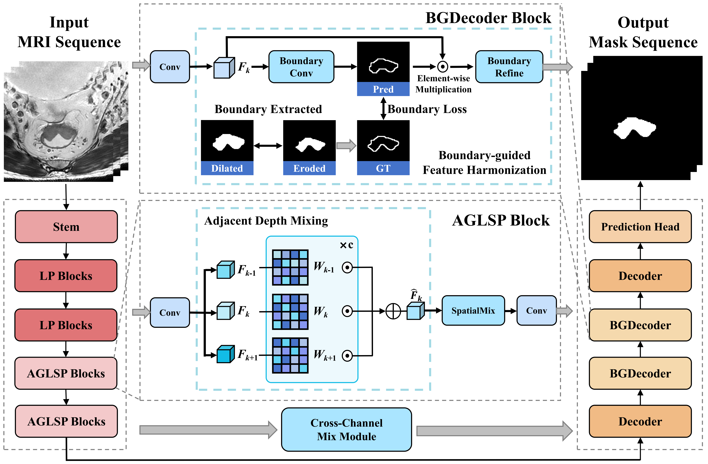

# DMBG-RWKV

Official PyTorch implementation of **DMBG-RWKV: Adjacent Depth Mixing and Boundary-guided Feature Harmonization for Medical Image Segmentation**

DMBG-RWKV is designed to address the limited use of inter-slice spatial information and imprecise boundary delineation in medical image segmentation. It uses Adjacent Depth Mixing (ADM) to fuse features from adjacent slices with spatially adaptive weights and feeds the fused representation into long-range in-plane modeling. It then introduces Boundary-guided Feature Harmonization (BFH) in the decoder, where boundary cues gate residual feature correction to progressively improve predictions around anatomical boundaries. DMBG-RWKV achieves an average DSC of 92.38% and an HD95 of 1.05 mm on the public ACDC benchmark, and has been accepted by ICIG 2026.

<p align="center">
  
</p>

## Contents

- [Installation](#installation)
- [Repository Layout](#repository-layout)
- [Data Preparation](#data-preparation)
- [Checkpoints](#checkpoints)
- [Reproduce Test Results](#reproduce-test-results)
- [Training](#training)
- [Citation](#citation)
- [Acknowledgements and License](#acknowledgements-and-license)

## Repository Layout

```text
dmbg-rwkv-2026/
├── configs/
│   └── acdc.json
├── doc/
│   ├── Overview.png
├── results/
│   └── main_results.md
├── scripts/
│   ├── eval.sh
│   ├── run_config.py
│   └── train.sh
├── src/
│   ├── ccm/
│   ├── cuda/
│   ├── datasets/
│   ├── module/
│   ├── rwkv_unet.py
│   ├── test.py
│   ├── train.py
│   ├── trainer.py
│   └── utils.py
├── CITATION.cff
├── LICENSE
├── NOTICE
├── README.md
├── THIRD_PARTY_NOTICES.md
├── pyproject.toml
└── requirements.txt
```

## Installation

Create the Conda environment and install the dependencies from the repository root:

```bash
conda create -n dmbg-rwkv python=3.9 -y
conda activate dmbg-rwkv
pip install -r requirements.txt
```

## Data Preparation

For ACDC data acquisition and preprocessing, refer to the instructions in [TransUNet](https://github.com/Beckschen/TransUNet). Place the prepared data under `data/ACDC`:

```text
data/ACDC/
├── ACDC_training_slices/
│   └── <patient>_<frame>_slice_<index>.h5
└── ACDC_training_volumes/
    └── <patient>_<frame>.h5
```

## Checkpoints

Place the following files under `checkpoints/`:

```text
checkpoints/
├── net_B.pth
└── acdc_best_model.pth
```

Download `net_B.pth` from [RWKV-UNet](https://github.com/juntaoJianggavin/RWKV-UNet) for training initialization. Download the released ACDC checkpoint [here](https://pan.baidu.com/s/1GJs_eUFZAjm4xeU3XhhnEA?pwd=1111).

## Reproduce Test Results

```bash
bash scripts/eval.sh configs/acdc.json \
  --path_specific checkpoints/acdc_best_model.pth
```

## Training

```bash
bash scripts/train.sh configs/acdc.json
```

## Citation

If you use this code, please cite our paper:

```bibtex
@inproceedings{xu2026dmbg,
  title     = {DMBG-RWKV: Adjacent Depth Mixing and Boundary-guided Feature Harmonization for Medical Image Segmentation},
  author    = {Xu, Tianzheng and Liu, Xinyan and Huang, Pengqi and Zhang, Xinfeng and Chen, Weidong and Zhang, Weigang and Chan, Antoni B. and Huang, Qingming},
  booktitle = {International Conference on Image and Graphics},
  year      = {2026},
  organization={Springer}
}
```

## Acknowledgements and License

This project builds on [RWKV-UNet](https://github.com/juntaoJianggavin/RWKV-UNet).

DMBG-RWKV project-owned code is released under the [MIT License](LICENSE). Third-party components retain their original licenses and notices; see [THIRD_PARTY_NOTICES.md](THIRD_PARTY_NOTICES.md).
